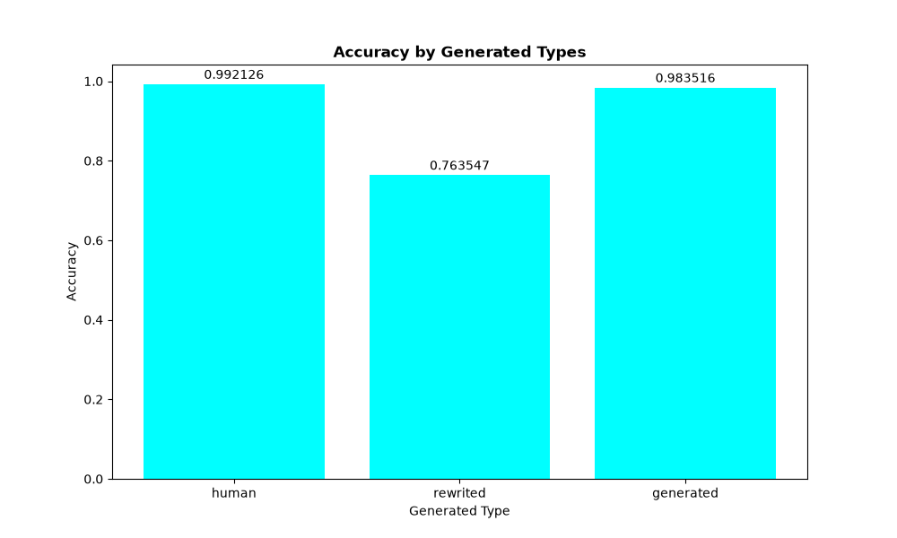
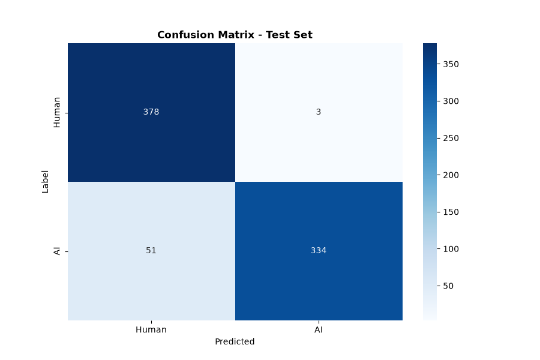
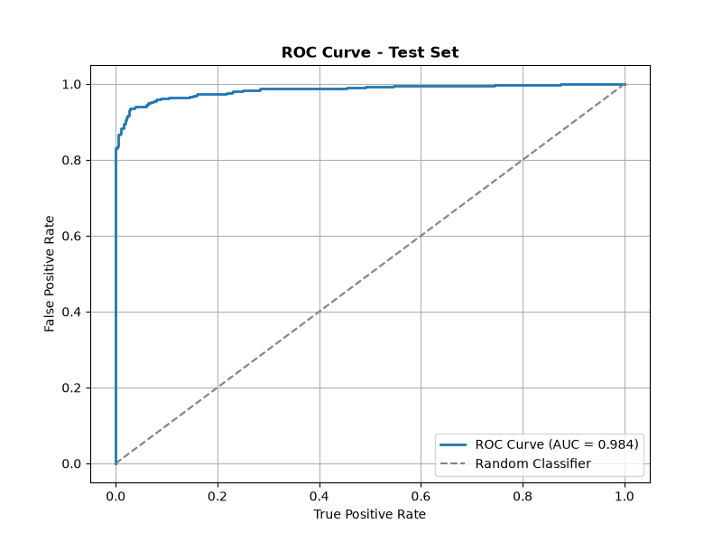

# Vietnamese AI Text Detector

Phát hiện văn bản tiếng Việt do AI tạo ra — model BamiBERT fine-tuned, API FastAPI, giao diện React, đóng gói Docker.

## Kết quả

| Metric | Human | AI |
|---|---|---|
| Precision | 0.99 | 0.87 |
| Recall | 0.88 | 0.99 |
| F1-score | 0.93 | 0.93 |

**Accuracy: 0.93** (766 mẫu test)

## Chạy nhanh (Docker)

```bash
docker compose up --build
```

- Frontend: `http://localhost:5173`
- Backend API: `http://localhost:8000/docs`

Checkpoint model (`models/best_model.pt`) được mount qua volume, không đóng gói cứng vào image — đảm bảo file tồn tại trong `models/` trước khi chạy.

---

<details>
<summary><strong>Kiến trúc hệ thống</strong></summary>

<!-- TODO: Upload sơ đồ kiến trúc hệ thống tổng thể -->


```
Người dùng
   │  dán văn bản
   ▼
Frontend (React + Vite → Nginx, container :5173→80)
   │  POST /predict, POST /explain
   ▼
Backend (FastAPI, container :8000)
   │  model load 1 lần lúc startup (lifespan + Depends), inference đồng bộ trong threadpool
   ▼
src/ (model, tokenizer, preprocessing, explainability — dùng chung với notebooks)
   │
   ▼
models/best_model.pt (mount qua volume, không nằm trong image)
```

**Quy ước quan trọng:** `/explain` luôn tính Integrated Gradients với `target_label` cố định là lớp **AI**, để dấu (+/-) của attribution score nhất quán trong mọi trường hợp — dương = bằng chứng ủng hộ AI, âm = bằng chứng ủng hộ con người — bất kể model dự đoán ra nhãn nào.

</details>

<details>
<summary><strong>Model & dữ liệu</strong></summary>

- **Kiến trúc:** BamiBERT (`Qualcomm-AI-Research/BamiBERT`) encoder + linear head trên token `[CLS]`.
- **Explainability:** Integrated Gradients (Captum), tách từ bằng `underthesea`.

<!-- TODO: Upload figures thống kê: confusion matrix, ROC curve, phân bố dữ liệu -->


<p align="center">
  
</p>

<!-- TODO: Upload sơ đồ flow thu thập dữ liệu -->
<p align="center">
  
</p>

Pipeline: thu thập (người viết vs AI tạo) → làm sạch (`src/preprocessing/cleaner.py`) → tokenize → train (`notebooks/03`) → đánh giá (`notebooks/04`) → explainability (`notebooks/05`, `06`).

</details>

<details>
<summary><strong>Giao diện</strong></summary>

<!-- TODO: Upload ảnh UI nhập liệu -->


<!-- TODO: Upload ảnh UI kết quả (gauge Human/AI) -->


<!-- TODO: Upload ảnh UI phần giải thích/highlight -->


</details>

<details>
<summary><strong>Cấu trúc project</strong></summary>

```
ai-content-detection/
├── notebooks/          # EDA, tiền xử lý, huấn luyện, đánh giá, explainability
├── src/                 # dùng chung giữa notebook và backend
├── models/best_model.pt
├── backend/
│   ├── Dockerfile
│   ├── requirements.txt        # bản rút gọn cho serving (không có torch+cu118)
│   └── app/
│       ├── main.py             # FastAPI, lifespan, CORS, routers
│       ├── core/config.py      # Settings tập trung
│       ├── services/model_service.py
│       ├── schemas/text.py
│       ├── dependencies.py
│       └── routers/            # health.py, predict.py, explain.py
├── frontend/
│   ├── Dockerfile / nginx.conf
│   └── src/
│       ├── App.jsx / api.js / styles.css
│       └── components/PredictionResult.jsx, HighlightedText.jsx
├── requirements-dev.txt        # đầy đủ: jupyter, matplotlib, sklearn, torch+cu118 — chỉ cho notebook/train
└── docker-compose.yml
```

</details>

<details>
<summary><strong>Chạy không dùng Docker (dev)</strong></summary>

```bash
# Backend
cd backend
pip install -r requirements.txt
uvicorn app.main:app --reload --port 8000

# Frontend
cd frontend
npm install
npm run dev
```

</details>

<details>
<summary><strong>Roadmap</strong></summary>

- [ ] Sliding-window inference cho văn bản dài hơn `max_length` (hiện tại truncate đơn giản).
- [ ] Giải thích bằng ngôn ngữ tự nhiên qua Gemini Flash (on-demand, có rate limiting).
- [ ] Thêm test cho `/explain`.
- [ ] Deploy cloud (hiện tại Docker chạy localhost).

</details>