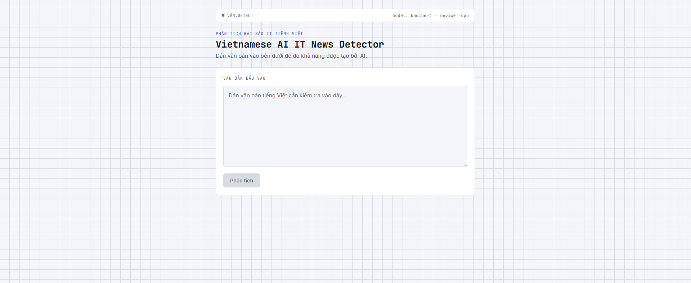
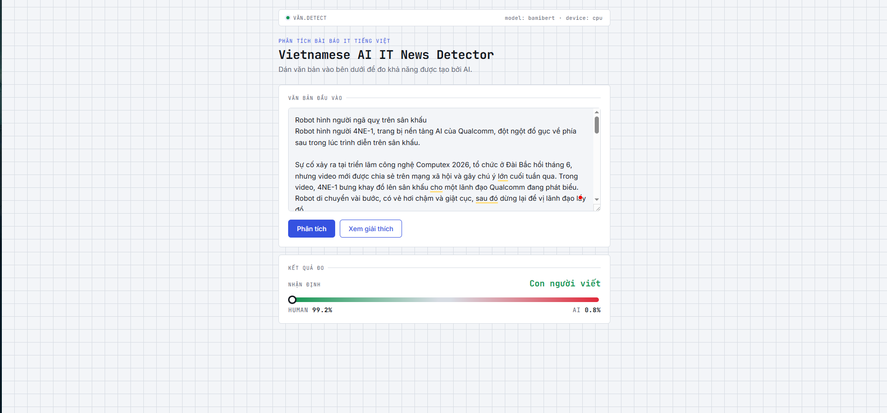
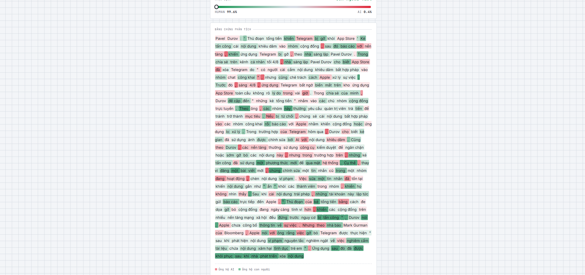
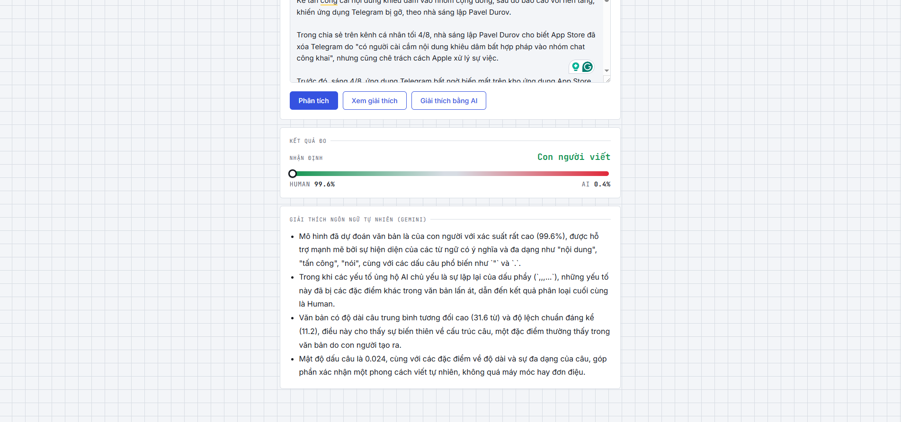
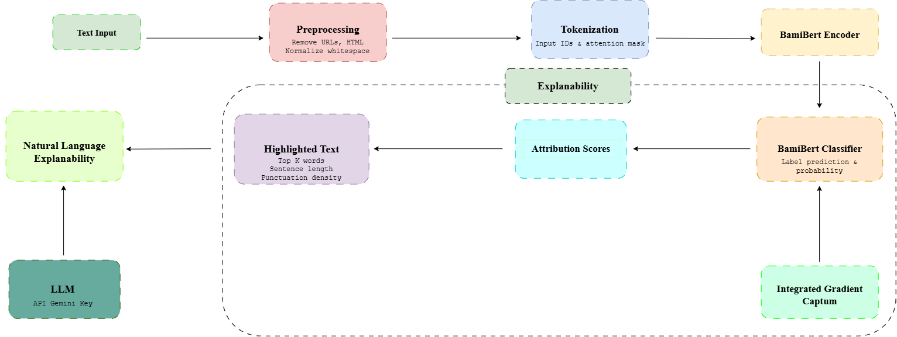
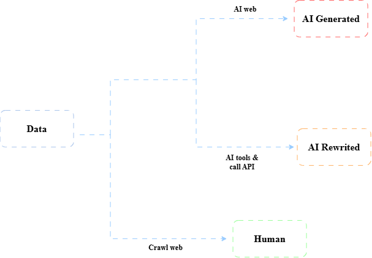

# Vietnamese AI Text Detector

Phát hiện văn bản tiếng Việt do AI tạo ra — BamiBERT fine-tuned + FastAPI backend + React frontend + Docker.

## Kết quả & Tính năng

**Model accuracy: 93%** (F1 score cân bằng 0.93 trên cả 2 lớp — precision 0.99 cho Human, recall 0.99 cho AI)

| Metric | Human | AI |
|---|---|---|
| Precision | 0.99 | 0.87 |
| Recall | 0.88 | 0.99 |
| F1-score | 0.93 | 0.93 |

**Tính năng chính:**
- Phân loại văn bản Human/AI (binary classification)
- Attribution-based explainability (Integrated Gradients via Captum, highlight từ-theo-từ)
- Giải thích ngôn ngữ tự nhiên (Gemini API, on-demand, grounded)
- Giao diện thân thiện (gauge measurement UI, 4-tier color highlighting)

## Chạy nhanh

```bash
# Clone + setup .env
cp .env.example .env
# (cập nhật APP_GEMINI_API_KEY nếu muốn dùng giải thích AI)

# Chạy docker
docker compose up --build
```

Truy cập:
- **Frontend:** http://localhost:5173 (nhập text, xem kết quả)
- **Backend API docs:** http://localhost:8000/docs (test endpoint)

**Lưu ý:** file checkpoint `models/best_model.pt` phải tồn tại (mount qua volume Docker).

---

## Tương tác qua API

```bash
# Dự đoán
curl -X POST http://localhost:8000/predict \
  -H "Content-Type: application/json" \
  -d '{"text": "văn bản test..."}'

# Attribution-based giải thích (Captum, luôn có)
curl -X POST http://localhost:8000/explain \
  -H "Content-Type: application/json" \
  -d '{"text": "văn bản test..."}'

# Giải thích bằng Gemini (on-demand, khi APP_GEMINI_API_KEY được set)
curl -X POST http://localhost:8000/explain-llm \
  -H "Content-Type: application/json" \
  -d '{"text": "văn bản test..."}'
```

---

## Giao diện

**Màn hình nhập liệu:**

> Dán văn bản tiếng Việt, bấm "Phân tích". Model sẽ dự đoán trong vài giây (CPU inference).

**Kết quả dự đoán (gauge):**

> Gauge hiển thị xác suất Human/AI. Số % chính xác cộng = 100%.

**Giải thích via Captum (highlight màu):**

> Từ nào ảnh hưởng tới AI/Human được tô màu. Đỏ = ủng hộ AI, xanh = ủng hộ Human. Độ đậm tương ứng cường độ ảnh hưởng (4 bậc rời rạc).

**Giải thích via Gemini (natural language):**

> Gemini sinh 3-5 bullet giải thích lý do dựa trên bằng chứng đã tính (từ-từ attribution, thống kê câu). Tất cả ở cache để tiết kiệm quota.

---

<details>
<summary><strong>Kiến trúc & quyết định kỹ thuật</strong></summary>



### Luồng xử lý
**Giải thích via Gemini (natural language):**

```
Request (text)
    ↓
Tiền xử lý (loại HTML, URL, khoảng trắng)
    ↓
Tokenize (BamiBERT byte-level BPE)
    ↓
BamiBERT encoder (12 lớp transformer) + classifier
    ↓
Dự đoán → prob_human, prob_ai
    ↓ (nếu gọi /explain)
Integrated Gradients (Captum) → attribution score/từ
    ↓ (nếu gọi /explain-llm)
Tính feature signals → Gemini sinh bullet
```

### Luồng thu thập dữ liệu
**Sơ đồ luồng thu thập dữ liệu**
<p align="center">
  
</p>

### Model

- **Backbone:** `Qualcomm-AI-Research/BamiBERT` — BERT tiếng Việt tiền-huấn luyện, không cần word segmentation.
- **Head:** linear layer trên token `[CLS]`, fine-tuned cho binary classification.
- **Checkpoint:** `models/best_model.pt` (CPU inference, không cần GPU).

### Backend (FastAPI)

- **Singleton pattern:** Model load 1 lần lúc `lifespan`, không reload mỗi request.
- **Dependency injection:** `Depends(get_model_service)` để inject service vào endpoint — dễ test (mock service).
- **Đồng bộ:** endpoint dùng `def` (không `async def`), FastAPI tự chạy trong threadpool vì inference là CPU-bound.
- **Endpoint:**
  - `GET /health` — kiểm tra server + model status
  - `POST /predict` — dự đoán ngắn gọn
  - `POST /explain` — attribution highlighting
  - `POST /explain-llm` — Gemini giải thích (on-demand, rate-limited)

### Frontend (React + Vite)

- **Build:** Vite + Nginx, multi-stage Docker (Node build → Nginx serve).
- **Giao diện:** JetBrains Mono cho nhãn/số liệu (lab-like feel), Inter cho nội dung.
- **Highlight:** 4 bậc opacity rời rạc (top 10%, 10-30%, 30-60%, 60-100%) thay gradient liên tục → dễ phân biệt bằng mắt.

### Giải thích AI (Gemini)

- **Không dùng RAG** — bằng chứng tính từ chính text đầu vào (attribution score, thống kê câu).
- **Grounded prompting** — đưa toàn bộ số liệu vào prompt, ép Gemini chỉ diễn giải dựa trên đó, không được suy đoán.
- **Cache:** SHA256(cleaned_text) → lưu result → tái sử dụng nếu cùng text → tiết kiệm quota.
- **Rate limiter:** `GlobalRateLimiter` (quota per project, không per key) — mặc định 10 req/phút.

### Cấu trúc project

```
ai-content-detection/
├── .env.example           ← Copy → .env, set APP_GEMINI_API_KEY
├── notebooks/             ← EDA, train, eval, XAI (chạy offline)
├── src/                   ← Dùng chung notebook + backend
│   ├── preprocessing/cleaner.py, tokenizer.py
│   ├── training/model.py, dataset.py, trainer.py, data_loader.py
│   ├── evaluation/inference.py
│   └── explainability/attribution.py (Captum), features.py, visualizer.py
├── models/best_model.pt   ← Mount qua volume Docker
├── backend/
│   ├── Dockerfile (Python slim, torch CPU-only)
│   ├── requirements.txt (rút gọn: FastAPI, transformers, captum, google-generativeai)
│   └── app/main.py, services/, schemas/, routers/
├── frontend/
│   ├── Dockerfile (multi-stage: Node build → Nginx)
│   └── src/App.jsx, components/, styles.css
├── requirements-dev.txt   ← Đầy đủ cho notebook (torch+cu118, jupyter, matplotlib, sklearn)
└── docker-compose.yml     ← Chạy backend + frontend cùng lúc
```

### Quyết định thiết kế quan trọng

1. **Target label cố định = AI** khi tính attribution — đảm bảo dấu (+/-) score nhất quán mọi lúc, không bị đảo ngược tùy theo nhãn dự đoán.
2. **Truncate text thay sliding-window** (MVP) — đơn giản hóa, `max_length=512` đủ cho hầu hết case.
3. **Backend CPU-only, frontend Nginx** — nhẹ hơn, rẻ hơn khi deploy cloud (không cần GPU cho inference realtime, batch thấp).

</details>

<details>
<summary><strong>Cài đặt & development</strong></summary>

### Cấu hình .env

Xem `.env.example`:
```bash
cp .env.example .env
# Sửa lại tuỳ ý, chủ yếu là APP_GEMINI_API_KEY nếu muốn dùng giải thích AI
```

### Chạy không Docker (dev)

```bash
# Backend
pip install -r requirements.txt
uvicorn backend.app.main:app --reload --port 8000

# Frontend (terminal khác)
cd frontend
npm install
npm run dev
```

### Chạy Docker (production-like)

```bash
docker compose up --build
```

### Notebook (training/evaluation)

```bash
pip install -r requirements-dev.txt
jupyter notebook
# Mở notebooks/03_model_training.ipynb rồi chạy các cell
```

</details>

<details>
<summary><strong>Roadmap</strong></summary>

- [x] Core detection (BamiBERT fine-tuned)
- [x] Attribution-based XAI (Captum Integrated Gradients)
- [x] Giải thích bằng LLM (Gemini, on-demand, grounded prompting)
- [x] Docker & Docker Compose
- [ ] Sliding-window inference cho text dài (hiện truncate)
- [ ] Full test suite (`pytest`)
- [ ] Deploy cloud (ECS, Cloud Run, hoặc VPS)
- [ ] Multi-language support (nếu có model đa ngôn ngữ)

</details>

---

## Yêu cầu

- Python 3.10+ (train) hoặc Python 3.11-slim (inference Docker)
- Node.js 18+ (frontend)
- Docker & Docker Compose (production)
- Google Generative AI API key (tùy chọn, để dùng `/explain-llm`)

## Tham khảo

- BamiBERT: https://huggingface.co/Qualcomm-AI-Research/BamiBERT
- Captum (Integrated Gradients): https://captum.ai
- FastAPI: https://fastapi.tiangolo.com
- Vite: https://vitejs.dev